# @tula/dashboard

The operator's dashboard: a single-page app the API serves at `/dashboard`
([ADR 0032](../../docs/adr/0032-dashboard.md)). An operator signs in with the deployment's
admin token and manages workspaces, projects, environments, users, keys and settings.
Operator-facing documentation is in [docs/dashboard.md](../../docs/dashboard.md); this file is
for people working on the app.

| | Light | Dark | 375 px |
| --- | --- | --- | --- |
| Users | 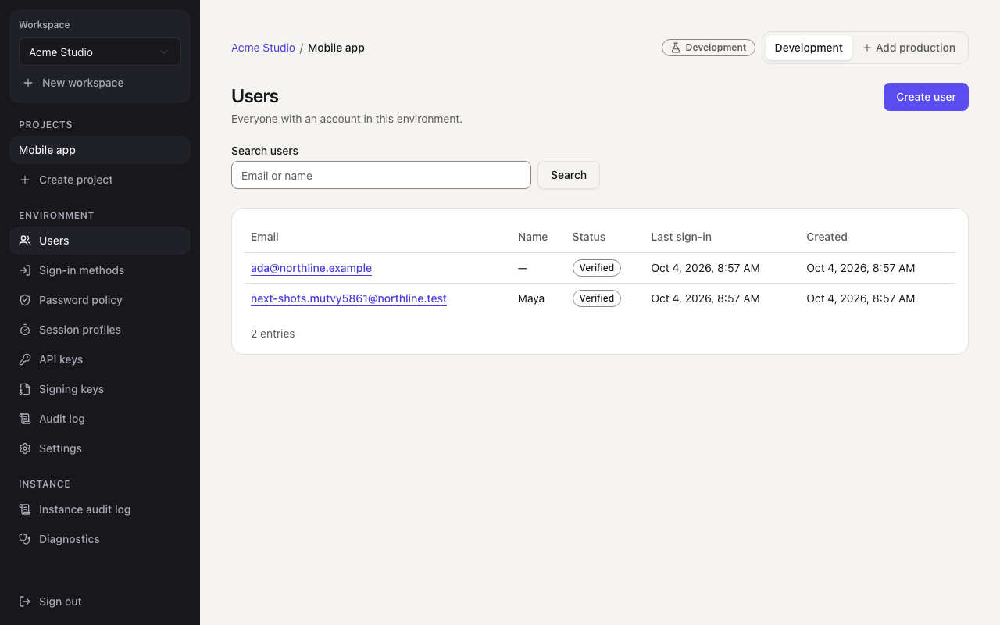 | 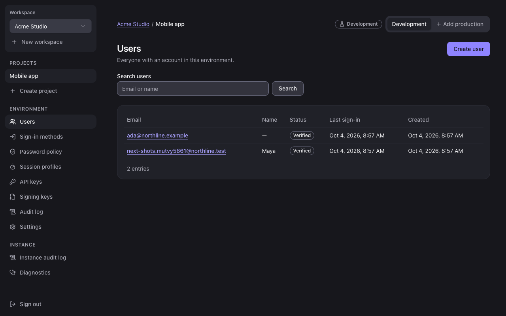 | 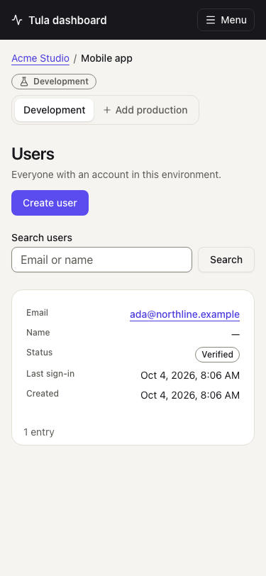 |
| Sign-in methods | 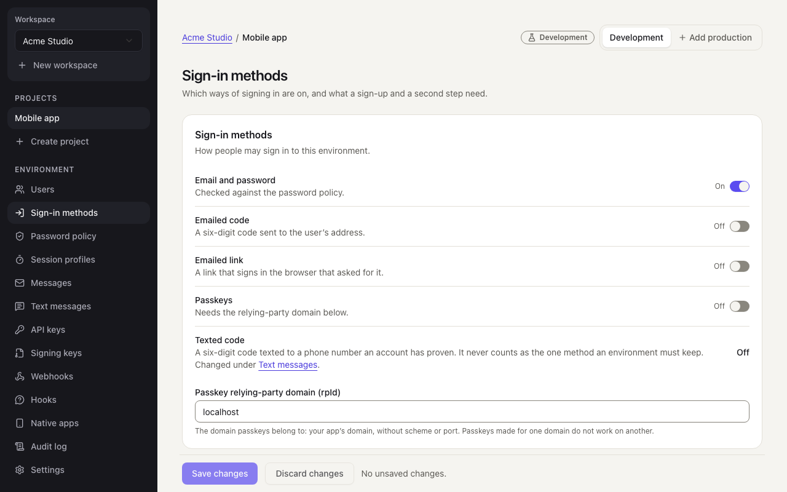 | 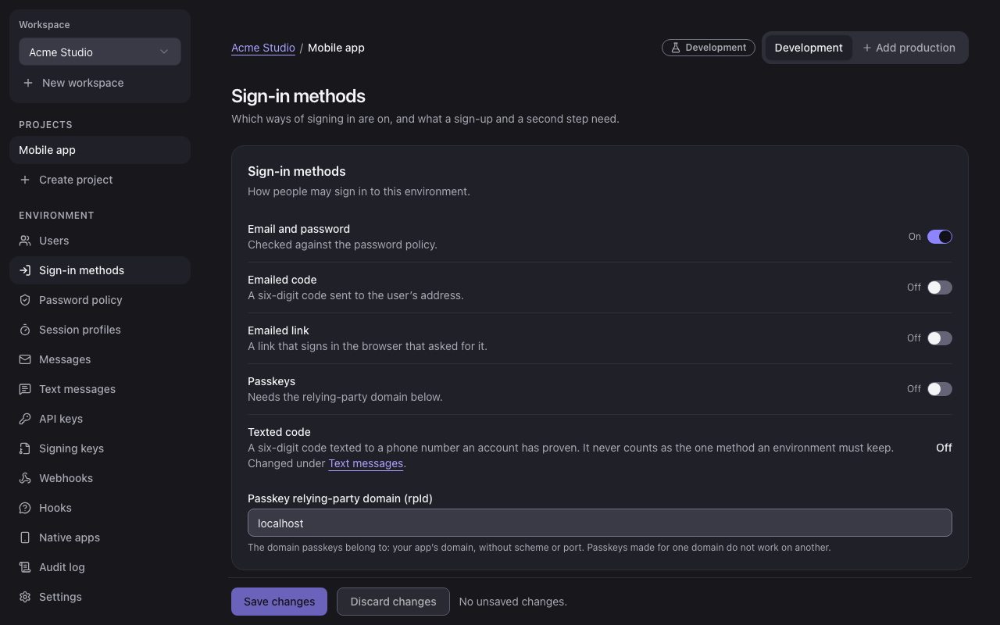 | 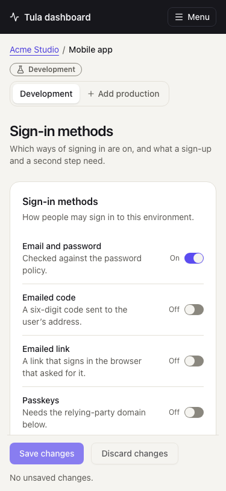 |
| Audit log | 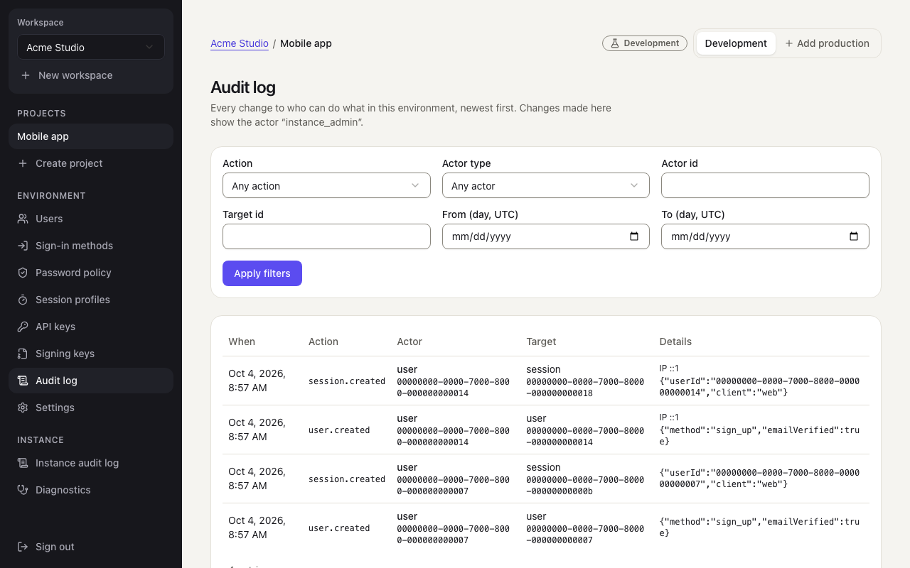 | 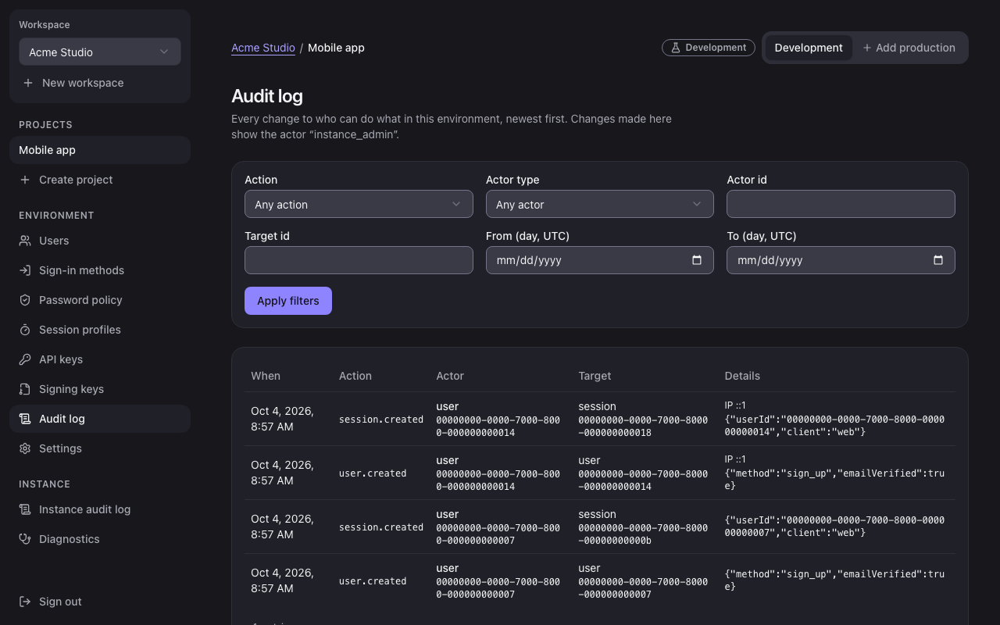 | 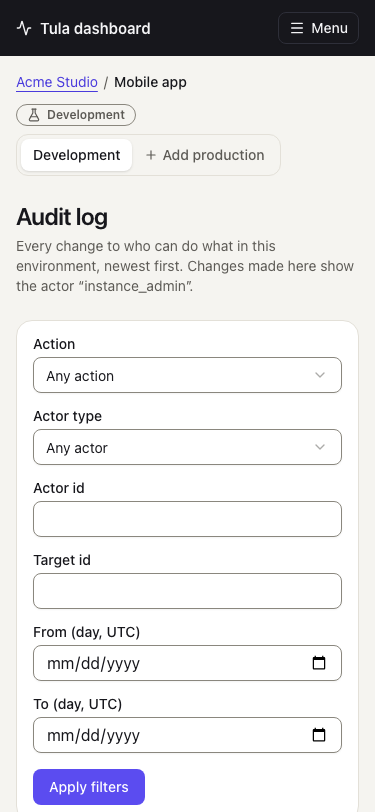 |
| Diagnostics | 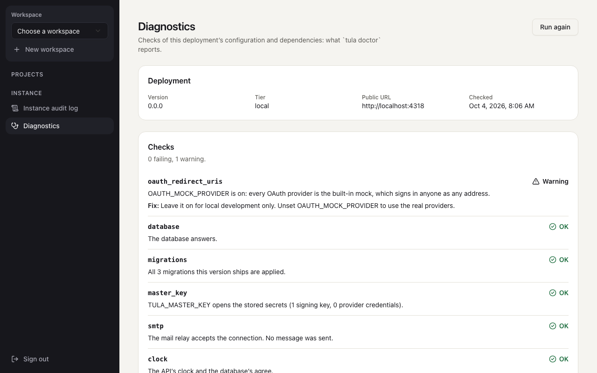 | 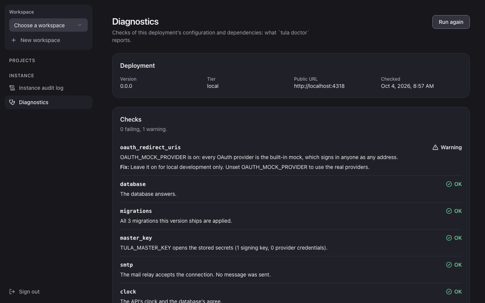 | 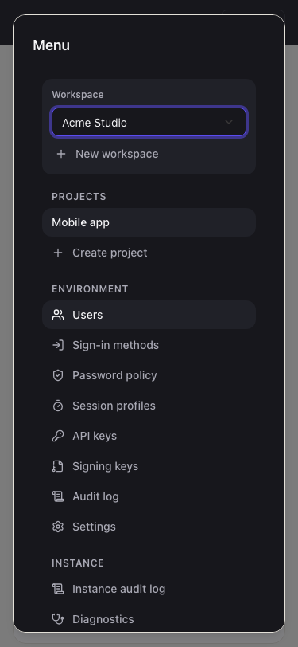 |

More: [sign-in](docs/sign-in.png) ([dark](docs/sign-in-dark.png)),
[workspace](docs/workspace.png), [a user](docs/user.png),
[confirming a ban](docs/user-confirm-ban.png),
[a weaker password policy](docs/password-policy-weaker.png),
[session profiles](docs/session-profiles.png), [settings](docs/settings.png),
[API keys](docs/api-keys.png), [signing keys](docs/signing-keys.png). They are regenerated by
`bun run e2e:screenshots` (`e2e/tests/dashboard/screenshots.spec.ts`).

## Running it

```bash
bun run dev                 # the API on http://localhost:3003 (needs TULA_ADMIN_TOKEN in .env)
bun run dashboard:dev       # the app on http://localhost:5175/dashboard/, proxying /v1 to the API
bun run dashboard:build     # apps/dashboard/dist, which the API serves at /dashboard
bun run dashboard:generate  # regenerate the three generated files (below)
```

The dev server proxies `/v1` to `TULA_API_URL` (default `http://localhost:3003`), so the
session cookie is same-origin in development exactly as it is in the image. `bun run dev`
serves a built `apps/dashboard/dist` at `http://localhost:3003/dashboard/` when one exists.

## Stack

Vite, React 19, TanStack Router (file-based) and Query, Tailwind v4, shadcn primitives,
Zustand, and hooks and types generated by Orval from `packages/contract/openapi.json`.

| Path | What |
| --- | --- |
| `src/routes/**` | One thin file per route. Route parameters and search parameters are read here and handed to a screen as props. |
| `src/features/<area>/` | The screens and their logic: `session`, `shell`, `workspaces`, `users`, `settings`, `keys`, `audit`, `diagnostics`. |
| `src/components/` | Shared pieces: `Modal`, `ConfirmDialog`, `Field`, `DataTable`, `QueryState`, `Toaster`. |
| `src/components/ui/` | shadcn primitives, written by its CLI (`bunx shadcn@latest add <name>`). **Never edited by hand**: wrap or extend them. |
| `src/api/mutator.ts`, `src/api/errors.ts` | The one way the app calls the API, and the one error it throws. |
| `src/api/generated/api.gen.ts` | Orval's hooks and types. Generated. |
| `src/routeTree.gen.ts` | TanStack Router's route tree. Generated. |
| `src/styles/tokens.gen.css` | The product's colours from `@tula/contract/theme`. Generated. |
| `src/state/` | Two Zustand stores: the selected scope (ids, mirrored from the address) and the session's status. Never a secret. |
| `src/testing/` | The test preload, a fake API and the harness that renders the whole app. |

### Generated files

`bun run dashboard:generate` writes all three; `generate:check` (part of `bun run verify`)
fails when a committed one is out of date. Run it after `bun run contract:generate`, after
adding or renaming a route file, and after changing a theme token.

Only `/v1/admin/*` and `/v1/instance/*` get hooks (`scripts/openapi-filter.ts`): the dashboard
has no way to call a client route.

## Rules

- **Every API call goes through a generated hook**, and so through `dashboardFetch`. It adds
  `x-tula-dashboard: 1`, sends the cookie, never sends `Authorization` and turns the error
  envelope into one `ApiError`. An admin call names its own environment: pass
  `request: useEnvironmentRequest()` to every admin hook. `dashboardFetch` never reads the
  environment from the scope store; it refuses an admin call that names none, or one that is
  no longer the selected one. Mutations run with `networkMode: 'always'`: nothing is queued
  while offline and sent later. A 401 `auth.unauthenticated` ends the session; the shell then
  returns to sign-in and comes back to the same address afterwards.
- **The address is the source of the selection.** `/w/<workspace>/p/<project>/e/<environment>/…`
  is shareable and survives a reload; the scope store only mirrors it (`syncScope`, called in
  each route's `beforeLoad`). Admin queries are keyed by path, not by environment, so
  `syncScope` drops every cached admin answer when the environment changes. Filters, search
  text and pages are search parameters.
- **The app runs under a strict Content-Security-Policy**: no inline script or style, no
  `eval`, nothing from another origin. Consequences:
  - Zod is switched to its interpreter (`src/lib/zod-csp.ts`, imported first by `main.tsx`);
    otherwise it probes for `new Function`, which the policy reports.
  - Dialogs are the platform's `<dialog>` (`components/modal.tsx`). Radix's dialog locks
    scrolling by injecting a `<style>` element, which `style-src 'self'` refuses; so does
    its select (shadcn's `native-select` is used instead) and every toast library looked at
    (`components/toaster.tsx` is a live region of a few lines).
  - Before adding a library, check that it injects no `<style>` or `<script>`. The browser
    tests fail on any violation.
- **Nothing secret is kept.** The admin token, a new API key, a typed password and a
  provider's secret exist only in the state of the form or dialog that shows them. Mutations
  that carry one use `gcTime: 0` and are `reset()` when the form lets go, because the query
  client keeps a mutation's variables. Nothing is written to `localStorage` or
  `sessionStorage` (the router's scroll restoration is off for that reason), and no secret
  goes into the address or a log.
- **Server text is rendered as text.** No `dangerouslySetInnerHTML`; audit metadata is shown
  as a JSON string in a `<code>`.
- **One save model for settings** (`features/settings/settings-editor.tsx`): load with the
  revision, edit a draft, replace the whole document with `If-Match`. A 412 is shown as
  "changed elsewhere" with a reload. A save that weakens security (the contract's
  `settingsWeakenings`) or changes settings a config file manages asks first. A new settings
  screen is a `SettingsFrame` and nothing else.
- **Destructive actions are confirmed by name**, and in a production environment by typing it
  (`ConfirmDialog`'s `requireText`).
- **Accessibility is part of done.** `Field` wires label, hint and error; `ActionButton`
  stays focusable while pending; `PageHeader` takes the focus after a navigation; state is
  said in words as well as colour; `DataTable` stacks rows under 640 px. axe runs on every
  screen in both colour schemes with no rule disabled.
- **Colours come from `@tula/contract/theme`** through `tokens.gen.css` and the variables in
  `styles.css`. No literal colour in a component.

## Tests

- `bun run --filter @tula/dashboard test`: bun test in happy-dom with Testing Library.
  `src/app.test.tsx` and `src/screens.test.tsx` render the whole app against
  `src/testing/fake-api.ts`; the mutator, the save model and the helpers have unit tests.
  Coverage is per file (80%, `bunfig.toml`).
- `bun run e2e`: the `dashboard` Playwright project (`e2e/tests/dashboard/`) drives the built
  app **served by the API at `/dashboard`** with its real Content-Security-Policy, against
  the real API in process. Every test fails on a policy violation, a console error or an
  uncaught exception.

## Design

The layout follows `docs/design/Design.pdf`, page 6: a dark navigation on the left with the
workspace at the top and its projects under it, a warm surface with white cards on the right,
and the environment switcher as a segmented control at the top right. Where it differs, and
why:

- **No overview page with summary cards** (platforms, publishable key, user count). The API
  has no user count or platform list; an environment opens on its users instead.
- **Sign-in methods are one screen, not a card.** Providers need a form each (client id,
  secret, redirect URI), which does not fit a row with a switch.
- **No "Members", "Billing" or "Theme"** in the navigation: Phase 1 has one operator
  credential and no theme editor. In their place are the screens the plan lists (password
  policy, session profiles, signing keys, settings) and the instance's own (audit log,
  diagnostics).
- **An environment badge next to the switcher**, with words and an icon: production must be
  unmistakable, and not by colour alone.
- **Session profiles are editable** rather than "Edit tula.config.ts"; a banner says when a
  config file manages the settings.
