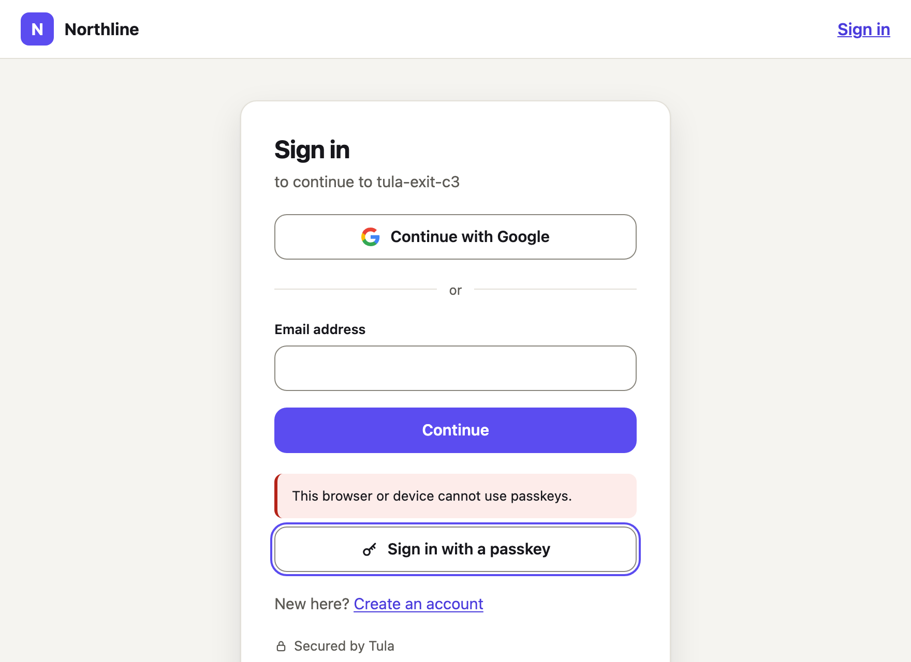

# Quickstart: from nothing to a signed-in user

You need [Bun](https://bun.sh) 1.2 or newer and Docker.

> **Nothing is published yet.** There is no `create-tula` on npm and no Tula API image in a
> registry, so today the first two steps happen in a checkout of this repository. Once the
> packages and the image are published, steps 1 and 2 disappear and step 3 becomes
> `bun create tula my-app`.

## 1. Build the API image

In the Tula repository:

```sh
docker build -f apps/api/Dockerfile -t tula-api:local .
```

`tula-api:local` is the image a new project names by default (`TULA_API_IMAGE` in its `.env`;
`--api-image` in step 3 names another).

## 2. Pack the packages

```sh
bun install
bun run packages:check       # builds and packs every package into .release/
```

`.release/` now holds `create-tula-0.0.0.tgz` and one `tula-<name>-0.0.0.tgz` per package.

## 3. Create the project

Anywhere outside the repository:

```sh
mkdir -p /tmp/create-tula && tar -xzf <repo>/.release/create-tula-0.0.0.tgz -C /tmp/create-tula
bun /tmp/create-tula/package/dist/bin.js my-app \
  --framework react-vite \
  --tula-packages <repo>/.release
cd my-app
bun install
```

`--framework` is `react-vite` or `nextjs`. `--tula-packages` points the project's `@tula/*`
dependencies at the tarballs; leave it out once they are on npm. `--api-port` and
`--mailpit-port` move the two published ports (3003 and 8025) if they are taken.

The project has a `.env` with secrets generated for it (a master key, an instance admin token,
two database passwords; readable by you only and ignored by git). **Back up
`TULA_MASTER_KEY`**: the stored signing keys and provider credentials cannot be opened without
it.

## 4. Start the stack

```sh
bunx tula dev
```

This starts Postgres, Redis, Mailpit and the API with Docker Compose, runs the migrations,
seeds a default project with a development and a production environment, mints development
keys into `.env.local`, and prints:

```text
Tula is running.
  API              http://localhost:3003
  API reference    http://localhost:3003/v1/docs
  Mail (Mailpit)   http://localhost:8025
  Publishable key  tula_pk_dev_…
  Secret key       in .env.local; --show-keys prints it
```

Run it again whenever you like: it reuses what is there. If a port is taken, change `API_PORT`
or `MAILPIT_UI_PORT` in `.env` and run `bunx tula dev` again.

## 5. Check it and apply your settings

```sh
bunx tula doctor      # database, migrations, master key, mail, Redis, URLs: each with its fix
bunx tula diff        # what tula.config.ts would change
bunx tula apply       # make the server match it
```

## 6. Sign up

```sh
bun run dev
```

Open the app (<http://localhost:5174> for Vite, <http://localhost:3000> for Next.js), choose
**Create an account**, and enter a name, an email address and a password. The verification
code arrives in Mailpit (<http://localhost:8025>): type it in, and you are signed in.



## 7. Google and a passkey, without touching server code

Both are settings of the environment, so they go in `tula.config.ts` and nothing else changes.
In the `dev` entry:

- under `settings.signIn.methods`, add `passkey: { enabled: true }`;
- beside it, `passkeys: { rpId: 'localhost' }` and
  `urls: { allowedOrigins: ['http://localhost:3000'] }` (the app's origin: passkeys need it
  listed even locally; use `5174` for Vite);
- beside `settings`, `providers: { google: { clientId: '…', clientSecret: env('GOOGLE_CLIENT_SECRET') } }`,
  importing `env` from `@tula/config`.

```sh
export GOOGLE_CLIENT_SECRET=…   # the secret is read from the environment, never from the file
bunx tula diff
bunx tula apply
```

Reload the sign-in page: it now has **Continue with Google** and **Sign in with a passkey**,
and the account page has a **Passkeys** section. The app's code did not change; the components
draw what the environment enables.

For real Google credentials follow [providers/google.md](providers/google.md). To try the
button before you have any, add `OAUTH_MOCK_PROVIDER=true` to the project's `.env` and run
`bunx tula dev` again: Google is then served by a built-in mock whose consent page signs in as
whatever address you type. It is for local development only, and `tula doctor` warns while it
is on.

This path was last run end to end on 2026-10-04 with the Next.js template, the mock provider
and Chromium's virtual authenticator: sign up, add a passkey, sign out, sign in with the
passkey, sign in with the Google button. Real Google and a physical authenticator were not
exercised ([what was not verified](plans/phase-1-unverified.md)).

## Afterwards

```sh
bunx tula policy test          # try a password against the environment's policy
bunx tula dev down             # stop the stack; the data is kept
bunx tula dev down --volumes   # stop it and delete the database
```

Every command and option is in [cli.md](cli.md); settings as code in [config.md](config.md);
each sign-in method in [its own page](README.md#sign-in-methods); running Tula for real in
[self-host.md](self-host.md).
