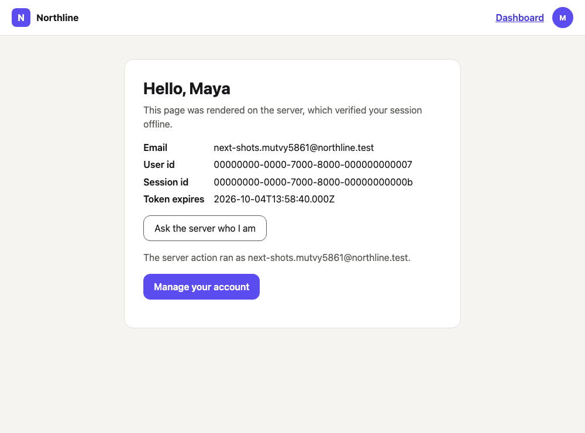
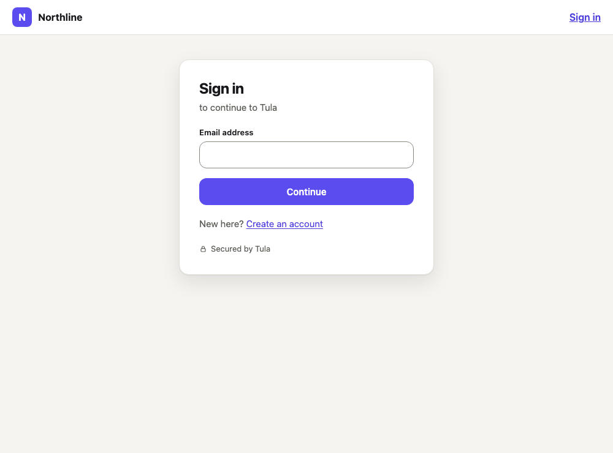
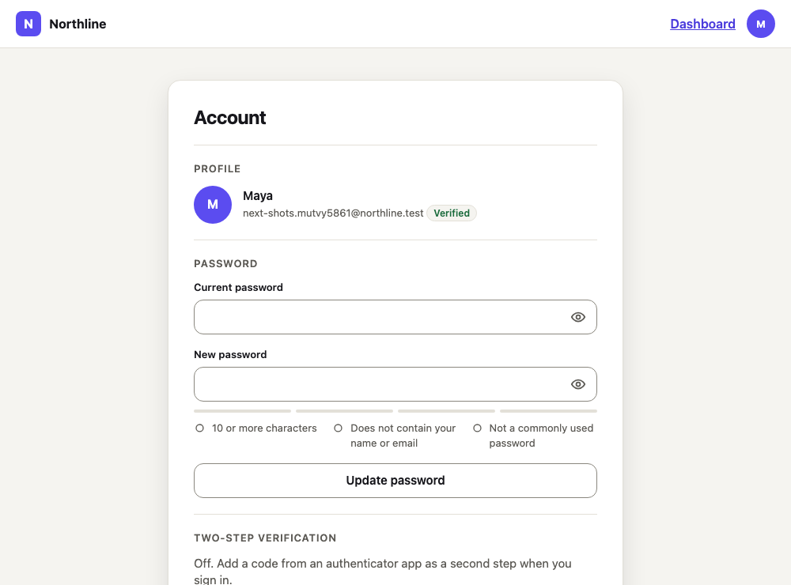
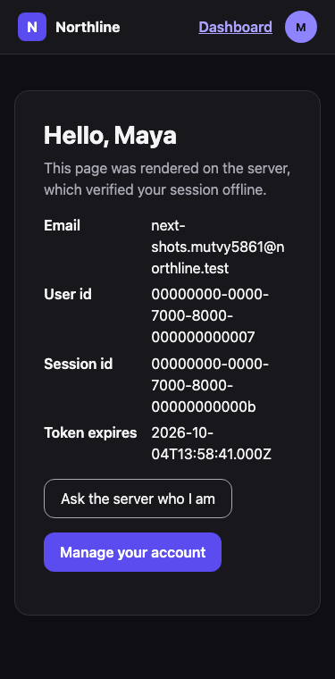

# Next.js App Router example

A Next.js 16 app whose authentication is [`@tula/nextjs`](../../packages/nextjs): a public home
page, sign-in and sign-up, a protected dashboard rendered on the server, a protected route
handler, a server action and the account page.

| | |
| --- | --- |
|  |  |
|  |  |

## What is where

| File | What it shows |
| --- | --- |
| `app/api/tula/[...tula]/route.ts` | The route handler: the browser talks to this origin, never to the API. |
| `proxy.ts` | Verifies the session offline, refreshes it, protects everything but `/`. |
| `app/layout.tsx` | `<TulaProvider>` with the server's `initialState`; a header that is right at first paint. |
| `app/dashboard/page.tsx` | A server component using `auth()` and `currentUser()`. |
| `app/dashboard/actions.ts` | A server action that checks the session itself. |
| `app/api/whoami/route.ts` | A protected route handler (401 when signed out). |
| `app/sign-in/page.tsx` | `<SignIn>` with a `redirect_url` checked by `safeRedirectPath`. |
| `app/profile/page.tsx` | `<UserProfile>`. |

## Which sign-in methods it has

All of them, and none in its code: `<SignIn>`, `<SignUp>` and `<UserProfile>` draw what the
environment's settings enable. Switch a method on (dashboard, `tula.config.ts` or the admin
API; [one page per method](../../docs/README.md#sign-in-methods)) and it appears here.

| Method or feature | Where it shows up | Browser test (`e2e/tests/nextjs/`) |
| --- | --- | --- |
| Password sign-up, sign-in | `/sign-up`, `/sign-in` | `app.spec.ts` |
| Password reset | `/sign-in`, "Forgot password?" | `methods.spec.ts` |
| Emailed code; sign-up without a password | `/sign-in`, `/sign-up` | `methods.spec.ts` |
| Emailed link (same browser) | `/sign-in`, then `/auth/link` | `callbacks.spec.ts` |
| Google, GitHub, Apple | `/sign-in`, then `/oauth/callback` | `callbacks.spec.ts` (mock provider) |
| Passkeys: button, autofill, add, rename, remove | `/sign-in`, `/profile` | `methods.spec.ts` (virtual authenticator) |
| Passkey as the second step and as step-up | `/sign-in`, the "Confirm it is you" dialog | `methods.spec.ts` |
| Authenticator app and backup codes; enrolment required at sign-in | `/profile`, `/sign-in` | `methods.spec.ts` |
| Step-up by authenticator, passkey or emailed code | the "Confirm it is you" dialog | `methods.spec.ts` |
| Devices: list and sign out | `/profile` | `methods.spec.ts` |
| The hybrid profile's cookies and their refresh; a stateful profile | every page | `app.spec.ts`, `methods.spec.ts` |
| The concurrent-session limit | `/sign-in` | `methods.spec.ts` |
| Server component, route handler, server action | `/dashboard`, `/api/whoami` | `app.spec.ts` |

## Run it

It is configured by environment variables only ([`.env.example`](.env.example) lists them).

```bash
# from the repository root, with the API running (bun run dev, or the Compose stack)
bun run seed                      # prints the environment id; then mint a publishable key:
bun run api-key:create --environment <id> --kind publishable

cd examples/nextjs-app-router
TULA_API_URL=http://localhost:3003 \
NEXT_PUBLIC_TULA_PUBLISHABLE_KEY=tula_pk_dev_… \
TULA_ENVIRONMENT_ID=<id> \
PORT=3100 bun run dev
```

- A local API (`ENVIRONMENT=local`) allows any loopback origin. Anywhere else, add this app's
  origin to the environment's `urls.allowedOrigins`.
- Run as above, the API sees every visitor at this server's address and they share one
  per-IP rate limit: fine on your own machine. Deployed behind a proxy, set
  `TULA_TRUSTED_PROXY_HOPS` to the number of proxies in front of this server that append to
  `X-Forwarded-For` (it trusts none by default) **and** start the API with `TRUST_PROXY=true`.
- For a `stateful` session profile also set `TULA_SECRET_KEY`.
- Emailed sign-in links lead to `/auth/link` and OAuth providers return to `/oauth/callback`
  (`app/auth/link/page.tsx`, `app/oauth/callback/page.tsx`; both public in `proxy.ts`). Outside
  a local API, list both full URLs in the environment's `urls.allowedRedirectUrls`.

## Tests

`bun run e2e` builds this app once and drives it with Playwright against the real API in
process (`e2e/tests/nextjs/`), with axe on every page and state in light and dark. `bun run e2e:screenshots` regenerates the screenshots above.
