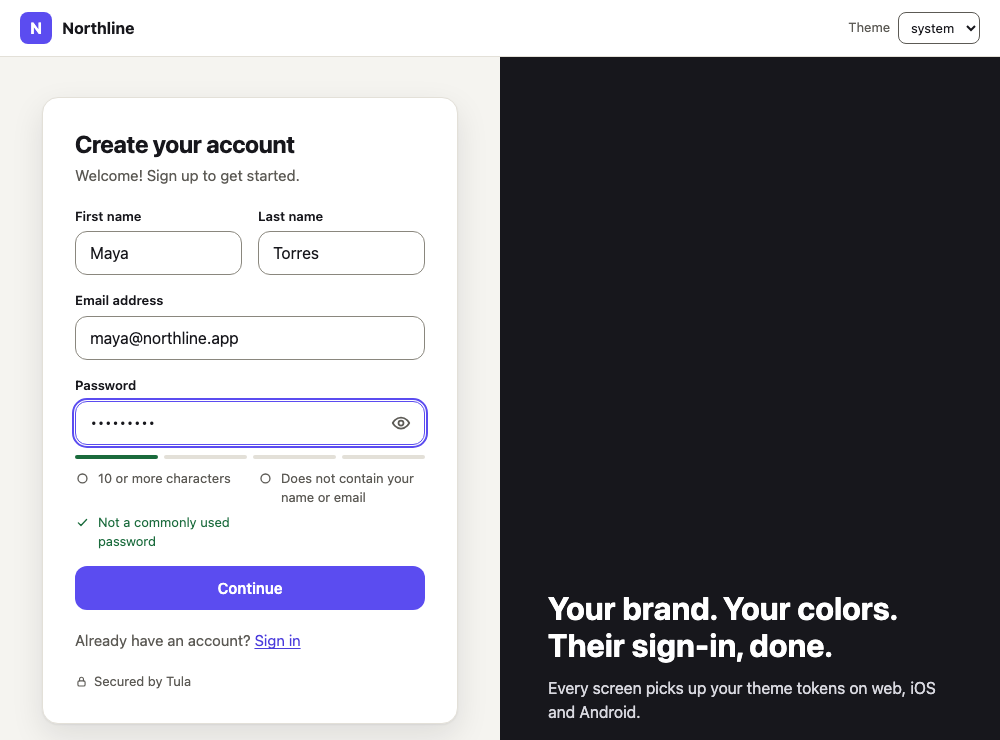
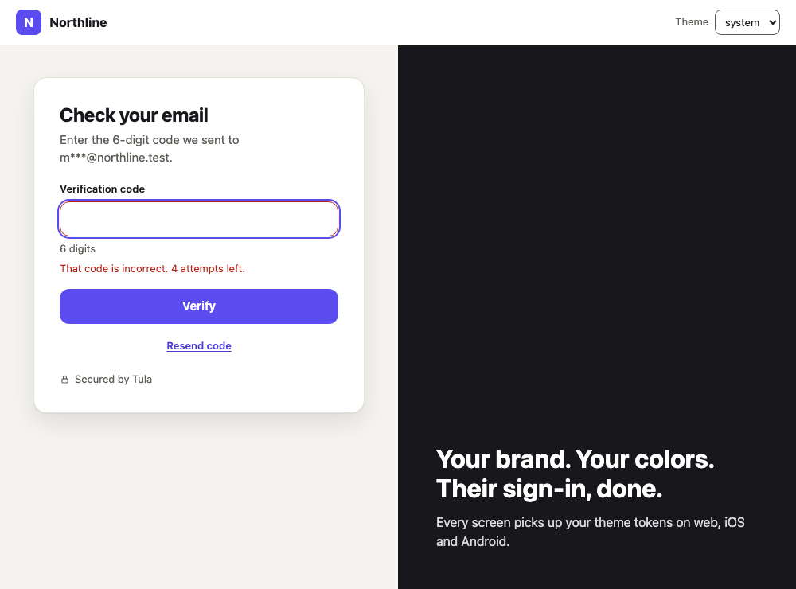
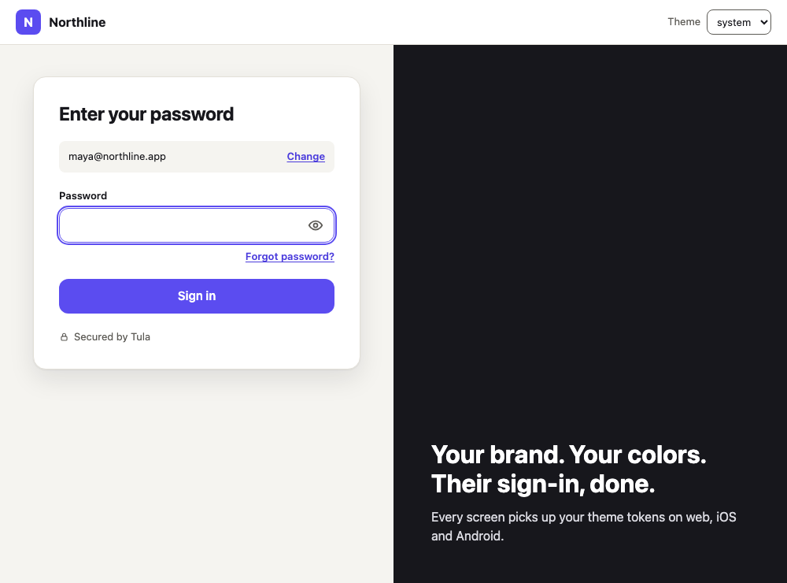
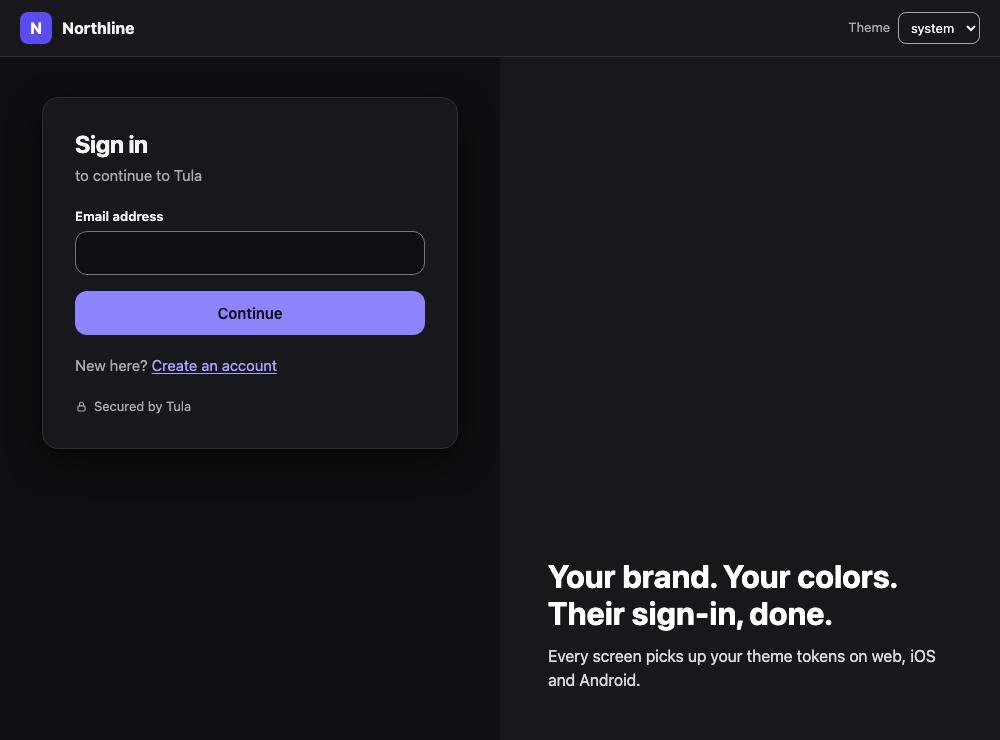
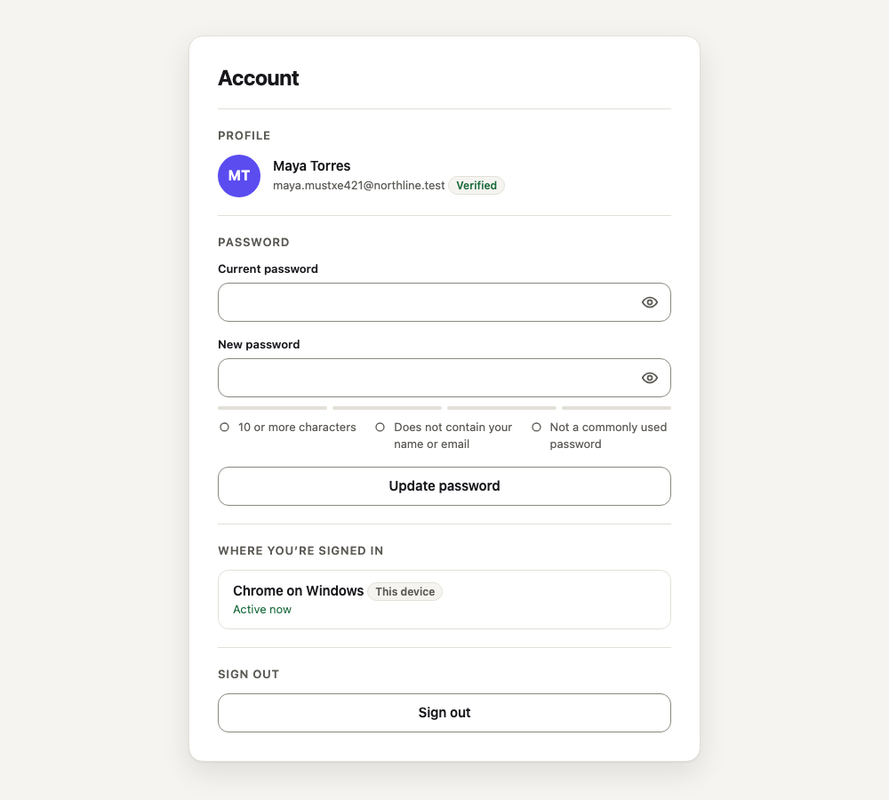
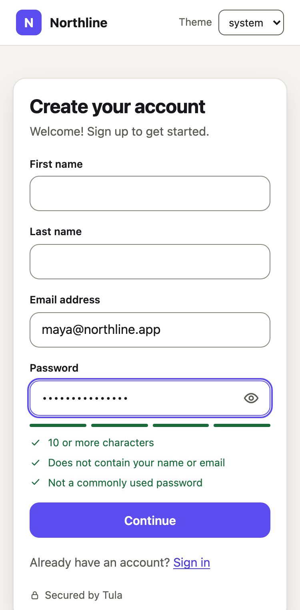

# @tula/react

React components and hooks for [Tula Auth](../../README.md): sign-up with email verification,
sign-in, forgotten-password reset and account management, themeable from one set of tokens and
accessible by default. Built on [`@tula/core`](../core/README.md); the components draw whatever
step the server answers with and hold no flow logic of their own.

> Not published yet. Inside this repository, depend on it with `"@tula/react": "workspace:*"`.

| | |
| --- | --- |
|  |  |
|  |  |
|  |  |

## Quickstart

```tsx
import { SignedIn, SignedOut, SignIn, TulaLoading, TulaProvider, UserButton } from '@tula/react'
import '@tula/react/styles.css'

export function App() {
  return (
    <TulaProvider
      publishableKey='tula_pk_dev_…'            // safe to embed in an app
      baseUrl='https://auth.example.com'        // where the Tula API is served
      signInUrl='/sign-in'
      signUpUrl='/sign-up'
      afterSignInUrl='/'
      afterSignOutUrl='/sign-in'
    >
      <TulaLoading>Loading…</TulaLoading>
      <SignedOut>
        <SignIn />
      </SignedOut>
      <SignedIn>
        <UserButton />
      </SignedIn>
    </TulaProvider>
  )
}
```

React 18.2 or 19. One stylesheet, no CSS framework, no icon library, no CSS-in-JS runtime. The
only runtime dependencies are `@tula/core` and the contract's Zod-free entry points:
13.3 kB gzip for this package (21.2 kB with `@tula/core`, React not counted) and 4.1 kB gzip of
CSS.

The app and the API must be same-site (`app.example.com` with `auth.example.com`, or two ports
on `localhost`) and the app's origin must be in the environment's allowed origins: see
[`@tula/core`'s security notes](../core/README.md#security-notes). A working app is in
[`examples/react-vite`](../../examples/react-vite).

## Provider

```tsx
<TulaProvider publishableKey baseUrl appearance? localization? navigate? {...urls}>
<TulaProvider client={createTulaClient(…)} …>     // or bring your own @tula/core client
```

Creates one client, calls `load()` once after mounting, and tries again (with a growing delay,
and when the browser comes back online) if the API cannot be reached.

| Prop | |
| --- | --- |
| `publishableKey`, `baseUrl` | The environment's key and the API's URL. A secret key is refused. |
| `client` | Instead of the two above: a client you created with `createTulaClient`. |
| `navigate` | `(url) => void`. Defaults to `window.location.assign`. Pass your router's function. |
| `signInUrl`, `signUpUrl` | Where the two components live; they link to each other with these. |
| `afterSignInUrl`, `afterSignUpUrl`, `afterSignOutUrl` | Where to go when each completes. Without one, nothing navigates: `<SignedIn>` / `<SignedOut>` swap the page. |
| `userProfileUrl` | Where `<UserProfile>` lives. Without it `<UserButton>` opens the profile in a dialog. |
| `appearance` | Theme tokens, colour scheme and class names for every component. |
| `localization` | Strings to change or translate. |

**URLs are only ever the ones you pass.** No component reads a destination from the query
string, the fragment or the server, so there is no `redirect_url` parameter to abuse. A URL is
followed only if it is relative or `http(s)`; anything else (`javascript:`, `data:`) is
ignored.

## Components

### `<SignIn>`

Email first, then whatever the server asks for: a password, an emailed code. "Forgot
password?" runs the reset in the same card (email → code and new password together → signed
in).

| Prop | |
| --- | --- |
| `signUpUrl`, `onSwitchToSignUp` | Shows "New here? Create an account" as a link, or calls you instead. |
| `afterSignInUrl`, `onComplete` | Go there once signed in, or get `{ userId, sessionId }` instead. |
| `initialEmail` | Prefills the email field. |
| `appearance`, `headingLevel` | See below. `headingLevel` (1–3, default 1) is the card title's level. |

### `<SignUp>`

Email and password with the **live password checklist**, then the emailed code.

| Prop | |
| --- | --- |
| `signInUrl`, `onSwitchToSignIn` | Shows "Already have an account? Sign in". |
| `afterSignUpUrl`, `onComplete` | As for `<SignIn>`. |
| `collectName` | Also ask for first and last name (optional for the user). |
| `appearance`, `headingLevel` | |

### `<UserButton>`

The user's initials; a menu with "Manage account" and "Sign out". Props: `afterSignOutUrl`,
`userProfileUrl`, `onManageAccount`, `appearance`.

### `<UserProfile>`

Profile, change password (other devices are signed out), "Where you're signed in" with this
device marked, sign out one device or all the others, sign out. Props: `afterSignOutUrl`,
`appearance`, `headingLevel`.

### `<SignedIn>`, `<SignedOut>`, `<TulaLoading>`

Render their children only in that state. During server rendering and until `load()` answers,
the state is loading: `<SignedOut>` does not flash a sign-in form at a signed-in user.

## How the screens are chosen

The server decides the next step; a component maps `step.status` to a screen and nothing else.

| Step | Screen |
| --- | --- |
| *(not started)*, `needs_identifier` | Email |
| `needs_password` | Password |
| `needs_first_factor` | The form of each offered strategy this version knows (`password` today); unknown strategies are skipped |
| `needs_email_verification` | The emailed code, with resend |
| `needs_new_password` | The emailed code and the new password, together |
| `complete` | "You are signed in", then `onComplete` or the after-URL |
| anything else (`needs_second_factor` until its screens ship, a status a newer server added) | **"This step is not supported"** with "Start again" |

An old SDK against a newer server therefore shows a clear message, never a blank card, and
never guesses at an action. A new sign-in method is one more entry in the strategy table in
`src/components/sign-in.tsx`, not new logic.

Errors come back from the server with a code. Problems about a field (`error.errors[]`: every
unmet password rule, an invalid email) are shown under that field; a wrong code shows how many
attempts are left; a rate limit or lockout (`retryAfterMs`) becomes a countdown that disables
the action until the server would accept it again; everything else (offline, the service
unavailable) is shown above the form.

### Password checklist

The checklist is the environment's own policy (`client.config.get()`), evaluated by
`evaluatePassword`, the function the server runs: they cannot disagree. The server still has
the last word (a breached password can only be checked there) and its answer is shown on the
field. For your own form:

```tsx
const { checks, ok } = usePasswordChecklist(password, { email })
```

## Theming

Three layers, from broad to narrow.

**1. Tokens.** Every visual decision is a token from
[`@tula/contract/theme`](../contract/src/theme.ts) (the same table the Swift and Kotlin SDKs
will generate constants from). Set them in CSS, anywhere above the components:

```css
:root {
  --tula-color-primary: #0f766e;        /* light */
  --tula-dark-color-primary: #5eead4;   /* dark */
  --tula-radius: 6px;
  --tula-font-family: 'Inter', sans-serif;
}
```

| Tokens (light `--tula-…`, dark `--tula-dark-…`) | |
| --- | --- |
| `color-background`, `color-surface`, `color-input` | Card, quiet panels, the inside of a field |
| `color-text`, `color-text-muted` | Text |
| `color-primary`, `color-primary-hover`, `color-primary-text` | The main button |
| `color-link`, `color-border`, `color-border-strong`, `color-focus` | Links, hairlines, control edges, the focus ring |
| `color-danger`, `color-danger-surface`, `color-success`, `color-overlay`, `shadow` | States, the dialog backdrop, the card shadow |
| **Shared:** `radius`, `radius-small`, `font-family`, `font-family-mono`, `font-size`, `font-size-small`, `font-size-title`, `spacing` | |

The scheme follows `prefers-color-scheme`. `data-tula-theme="light"` or `"dark"` on any
ancestor (or `appearance.colorScheme`) forces one. If you change colours, keep text at 4.5:1
and control edges and the focus ring at 3:1; `contrastRatio` from `@tula/contract/theme`
computes it, and the default theme is held to that by a test.

**2. `appearance`.** The same tokens from JavaScript, plus class names, on the provider (all
components) or on one component (which wins):

```tsx
<SignIn
  appearance={{
    theme: { light: { primary: '#0f766e' }, dark: { primary: '#5eead4' }, radius: '6px' },
    colorScheme: 'system',                       // 'light' | 'dark' | 'system'
    elements: { card: 'my-card', primaryButton: 'my-button' },
  }}
/>
```

**3. Your own CSS.** Every part has a stable class (`tula-card`) and a stable
`data-tula-element` attribute (`card`), listed in `ELEMENT_NAMES`:
`root`, `card`, `header`, `title`, `subtitle`, `form`, `field`, `label`, `inputGroup`, `input`,
`codeInput`, `passwordToggle`, `hint`, `fieldError`, `error`, `status`, `primaryButton`,
`secondaryButton`, `dangerButton`, `linkButton`, `link`, `spinner`, `identity`, `strengthBar`,
`checklist`, `checklistItem`, `footer`, `branding`, `avatar`, `badge`, `userButton`,
`userButtonTrigger`, `menu`, `menuHeader`, `menuItem`, `dialog`, `section`, `sectionTitle`,
`profile`, `sessionList`, `sessionItem`.

Every selector in the stylesheet is wrapped in `:where()`, so it has **no specificity**:
`.tula-card { box-shadow: none }` in your CSS wins without `!important`, wherever it is loaded.
The other side of that: a broad rule of yours such as `button { … }` or `:focus-visible { … }`
also wins. Scope such rules to your own markup.

## Localization

Every string the components show is in one typed table, `TulaLocalization`; `EN_LOCALIZATION`
is the English one. Pass any subset:

```tsx
<TulaProvider
  localization={{
    locale: 'es',                                   // for relative times ("hace 2 días")
    signIn: { title: 'Inicia sesión', continue: 'Continuar' },
    password: { rules: { min_length: '{min} caracteres o más' } },
    errors: { 'auth.invalid_credentials': 'El correo o la contraseña no son correctos.' },
  }}
  …
>
```

Messages for errors the API reports are not duplicated here: they are `@tula/core`'s table,
keyed by error code, and `localization.errors` is handed to the client (`setMessages`).
Only known keys with string values are taken from the table, and strings are rendered as text,
never as HTML.

## Headless hooks

For your own UI on the same engine.

```tsx
const { status, isLoaded, isSignedIn, sessionId, getToken, signOut } = useAuth()
const { user, reload } = useUser()
const { sessions, revoke, revokeOthers, error } = useSession()
const tula = useTula()                              // the @tula/core client

const signIn = useSignIn()                          // also useSignUp(), useResetPassword()
signIn.step                                         // FlowStep | null: draw one screen per status
signIn.isPending
signIn.error                                        // TulaError | null: code, message, errors[], retryAfterMs
await signIn.start({ identifier })
await signIn.submitPassword({ password })           // resolves with the next step, or null (see error)
await signIn.verifyEmail({ code })
await signIn.resendCode()
signIn.reset()
```

Flow actions never reject: they resolve with the next step, or `null` with the reason in
`error`. A second action while one is pending resolves `null` and sends nothing. Treat a status
you do not know as "unsupported", as the components do.

## Accessibility

Built to WCAG 2.2 AA and checked by axe in a real browser on every screen and state, in both
schemes (no rule disabled).

- Real `<form>`s and `<label>`s. Errors are tied to their field (`aria-invalid`,
  `aria-describedby`) and announced (`role="alert"`); quiet confirmations use a polite live
  region.
- When the step changes, focus moves to the new card's title, so the change is announced and
  Tab continues from the top. After a failed action, focus moves to the first invalid field.
  The first screen of a component does not take focus: the page owns that.
- The password checklist says each rule's state as text ("Met: …", "Not met: …"), not only by
  colour and icon, and a polite summary ("2 of 3 password requirements met") follows typing.
- A pending button keeps its name, its focus and its place in the tab order (`aria-disabled`
  and `aria-busy`, not `disabled`).
- The user menu is a menu button: Enter, Space or the arrow keys open it, arrows / Home / End
  move, Escape closes and returns focus. The profile dialog is a native modal `<dialog>`.
- Code field: `inputmode="numeric"`, `autocomplete="one-time-code"`, one input, so SMS/email
  autofill and pasting a whole code work. Password fields use `current-password` /
  `new-password`, with the account's address in a hidden `username` field for password
  managers.
- Targets are at least 24×24 px; `prefers-reduced-motion` turns transitions and the spinner's
  rotation off; the default colours meet 4.5:1 for text and 3:1 for control edges and focus
  rings in both schemes (computed in `@tula/contract`'s tests).
- A step change in a single-page app is not a page load: if your router swaps the page after
  `onComplete`, move focus to the new page's heading as you would for any route change.

## Server rendering

Every export is a client component (`'use client'`). Nothing touches `window` or `document`
while rendering, so the provider and the components can be rendered on a server: the state is
`loading` there, `<SignedIn>` and `<SignedOut>` render nothing, and `<SignIn>` renders its
first screen. The browser hydrates that without a mismatch and then finds out who is signed in.
Server-side session checks (`auth()`, middleware) come with `@tula/nextjs`.

## Security notes

- Tokens: see `@tula/core`. This package adds no storage of its own: nothing is written to
  `localStorage`, `sessionStorage`, a cookie, a URL or a DOM attribute.
- Passwords and codes live in component state only while their form is on screen and are
  cleared when it is submitted or goes away. Nothing is logged.
- Nothing from the server is rendered as HTML (no `dangerouslySetInnerHTML`); a session's user
  agent is only matched against fixed patterns to name the device.
- Navigation targets are the developer's props only, checked to be relative or `http(s)`.

## Development

```bash
bun run --filter @tula/react test            # components against @tula/core's fake API, in happy-dom
bun run --filter @tula/react generate        # rewrite the stylesheet's token block from the contract's theme
bun run e2e:install                          # once: Chromium for Playwright
bun run e2e                                  # the example app against the real API in process, with axe
bun run e2e:screenshots                      # regenerate the screenshots above
```

Design and reasoning: [ADR 0022](../../docs/adr/0022-react-sdk.md).
